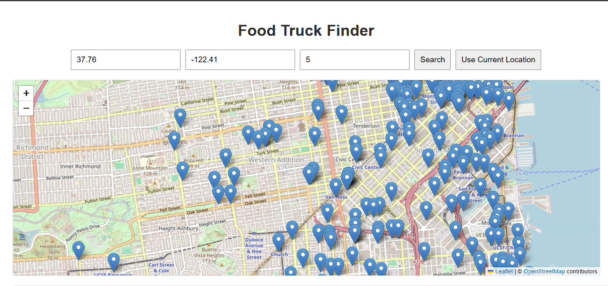

# Food Truck Web App



## Installation

### Prior Requirements
You're going to need Docker and Docker Compose to run this project. The easiest and recommended way to get Docker Compose is to install Docker Desktop. Docker Desktop includes Docker Compose along with Docker Engine and Docker CLI which are Compose prerequisites.
Installation instructions can be found here:

https://docs.docker.com/compose/install/

### How-To

1. **Clone The Repo**

```bash
git clone https://github.com/tumultousRamen/food-truck-web
cd food-truck-web
```

2. **Use Docker Compose to build and start Backend, Frontend and DB containers**

```bash
docker-compose up --build
```

This command will build and start the frontend, backend, and DB containers.

## Viewing the Application

- Frontend: <http://localhost:3000>
- Backend: <http://localhost:5001>

Users can either use their current location to fetch nearby food trucks in ascending order of their vicinity to the user, or manually enter their desired location's longitude and latitude. 


## Stopping all Containers 

```bash
docker-compose down
```

## License

This project is licensed under the MIT License - see the [LICENSE](./LICENSE) file for details.
